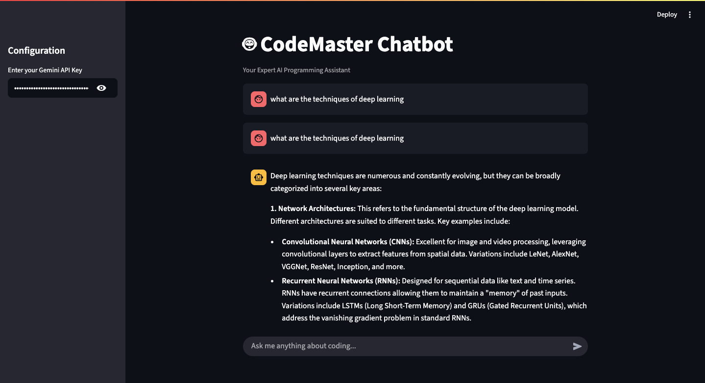

# 🤖 CodeMaster: AI Coding Chatbot

Welcome to CodeMaster, a powerful and interactive AI-powered chatbot designed to be your personal programming assistant. Built entirely with Python, this application leverages a modern tech stack to provide seamless code generation, debugging, and explanation capabilities.

## ✨ Features

-   **Code Generation:** Get high-quality code snippets in various languages on demand.
-   **Code Debugging:** Analyze your code, identify errors, and receive corrected versions with clear explanations.
-   **Code Explanation:** Understand complex algorithms or code blocks with simple, easy-to-digest breakdowns.
-   **Conversational History:** The chatbot remembers the context of your conversation for relevant follow-up questions.
-   **Interactive UI:** A clean and intuitive web interface built with Streamlit.

---

## 📸 Screenshots

Here's a glimpse of the CodeMaster chatbot in action:

**Answering a general question about Machine Learning:**


**Detailing specific techniques within Machine Learning:**


---

## 🛠️ Tech Stack & Architecture

This project uses a decoupled frontend and backend architecture for scalability and separation of concerns.

-   **Frontend:** **Streamlit** - For creating a fast, interactive user interface.
-   **Backend:** **FastAPI** - A high-performance Python web framework for building the API.
-   **AI Model:** **Google Gemini API** (`gemini-1.5-flash`) - Powers the core intelligence of the chatbot.
-   **Language:** **Python 3**

<br>

**How it works:**
The Streamlit frontend captures user input and sends it to the FastAPI backend. The backend constructs a detailed prompt, communicates with the Google Gemini API, and streams the response back to the user interface.

---

## ⚙️ Setup and Installation

Follow these steps to get the project running on your local machine.

### Prerequisites

-   Python 3.8+
-   A Google Gemini API Key. You can get one from [Google AI Studio](https://aistudio.google.com/app/apikey).

### Installation Steps

1.  **Clone the repository:**
    ```bash
    git clone [https://github.com/your-username/codemaster-chatbot.git](https://github.com/your-username/codemaster-chatbot.git)
    cd codemaster-chatbot
    ```

2.  **Create and activate a virtual environment (recommended):**
    ```bash
    # For macOS/Linux
    python3 -m venv venv
    source venv/bin/activate

    # For Windows
    python -m venv venv
    .\venv\Scripts\activate
    ```

3.  **Install the required dependencies:**
    ```bash
    python3 -m pip install -r requirements.txt
    ```

---

## 🚀 How to Run

This application requires two terminals to run simultaneously: one for the backend and one for the frontend.

### 1. Start the Backend Server

-   Open your first terminal and navigate to the `backend` directory:
    ```bash
    cd backend
    ```
-   Run the Uvicorn server:
    ```bash
    uvicorn main:app --reload
    ```
-   The backend API will now be live at `http://127.0.0.1:8000`. Leave this terminal running.

### 2. Start the Frontend Application

-   Open a **second** terminal and navigate to the `frontend` directory:
    ```bash
    cd frontend
    ```
-   Run the Streamlit application:
    ```bash
    python3 -m streamlit run app.py
    ```
-   Your web browser will automatically open to the chatbot interface, usually at `http://localhost:8501`.

### 3. Configure the Chatbot

-   On the application's webpage, open the sidebar on the left.
-   Enter your **Google Gemini API Key** into the input field.
-   You are now ready to start chatting!
